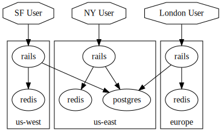
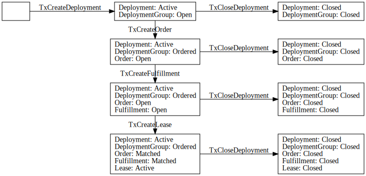

  * [Workflow](#workflow)
  * [Use Cases](#use-cases)
    * [Web Application](#web-application)
  * [Actors](#actors)
    + [Tenants](#tenants)
    + [Datacenters](#datacenters)
    + [Validators](#validators)
    + [Marketplace Facilitators](#marketplace-facilitators)
  * [Distributed Exchange](#distributed-exchange)
    + [Global Parameters](#global-parameters)
    + [Models](#models)
      - [ComputeUnit](#computeunit)
      - [ResourceGroup](#resourcegroup)
      - [Deployment](#deployment)
      - [DeploymentInfrastructure](#deploymentinfrastructure)
      - [Order](#order)
      - [Fulfillment](#fulfillment)
      - [Lease](#lease)
      - [LeaseConfirmation](#leaseconfirmation)
    + [Transactions](#transactions)
    + [SubmitDeployment](#submitdeployment)
    + [UpdateDeployment](#updatedeployment)
    + [CloseDeployment](#closedeployment)
    + [DeploymentClosed](#deploymentclosed)
    + [SubmitFulfillment](#submitfulfillment)
    + [CancelFulfillment](#cancelfulfillment)
    + [SubmitLeaseConfirmation](#submitleaseconfirmation)
    + [SubmitLease](#submitlease)
    + [SubmitStaleLease](#submitstalelease)
    + [Workflows](#workflows)
      - [Tenants](#tenants-1)
      - [Marketplace Facilitators](#marketplace-facilitators-1)
        * [MatchOpenOrders](#matchopenorders)
        * [InvalidateStaleLeases](#invalidatestaleleases)
      - [Datacenters](#datacenters-1)
        * [ConfirmCurrentLeases](#confirmcurrentleases)
        * [BidOnOpenOrders](#bidonopenorders)
  * [Deployments](#deployments)
    + [Workflow](#workflow-1)
    + [Manifest Distribution](#manifest-distribution)
    + [Overlay Network](#overlay-network)
    + [Closing Deployments](#closing-deployments)
    + [Models](#models-1)
      - [Stack](#stack)
      - [Manifest](#manifest)
      - [Deployment](#deployment-1)
      - [Workload](#workload)
      - [Connection](#connection)
      - [LeasedWorkload](#leasedworkload)
  * [Automation](#automation)
    + [Examples](#examples)
      - [Latency-Optimized Deployment](#latency-optimized-deployment)
      - [Machine Learning Deployment](#machine-learning-deployment)
- [TODO](#todo)

### Workflow

* [Tenants](#tenants) [define](#deployment) desired infrastructure, workloads to run on infrastructure, and how workloads can connect to one another.
  * Desired lifetime of resources is expressed via [collateral](#resourcegroup) requirements.
* [Orders](#order) are generated from the [tenant's definition](#deployment).
* [Datacenters](#datacenters) [bid](#fulfillment) on open [orders](#order).
* The [bid](#fulfillment) with lowest price gets [matched](#matchopenorders) with [order](#order) to create a [lease](#lease).
* Once [lease](#lease) is reached, workloads and topology are delivered to [datacenter](#datacenters).
* [Datacenter](#datacenters) deploy workloads and allow connectivity as specified by the tenant.
* If a [datacenter](#datacenters) fails to maintain lease, collateral is transferred to tenant, and a new [order](#order) is crated for the desired resources.
* A tenant can [close](#close) any active deployment at any time

### Use Cases

#### Web Application

## Actors

### Tenants

A tenant hosting an application on the Akash network

### Datacenters

Each datacenter will host an agent which is a mediator between the with the Akash Network and datecenter-local infrastructure.

The datacenter agent is responsible for

* Bidding on [orders](#order) fulfillable by the datacenter.
* Managing managing active leases it is a provider for.

### Validators

A Akash Node that is elected to be a validator in the DPoS consensus scheme.

### Marketplace Facilitators

Marketplace facilitators maintain the distributed exchange (marketplace).  [Validators](#validators) will initially perform this function.

## Distributed Exchange

### Global Parameters

|Name|Description|
|---|---|
|reconfirmation-period| Number of blocks between required [lease confirmations](#leaseconfirmation)|
|collateral-interest-rate| Interest rate awarded to [datacenters](#datacenters) for collateral posted with [fulfillments](#fulfillment) |

### Models

#### ComputeUnit

| Field  | Definition |
|--------|------|
| cpu    | Number of vCPUs |
| memory | Amount of memory in GB |
| disk   | Amount of block storage in GB |

#### ResourceGroup

| Field | Definition |
|---|---|
| compute    | [compute unit](#computeunit) definition |
| price      | Price of [compute unit](#computeunit) per time unit |
| collateral | Collateral per [compute unit](#computeunit) |
| count      | Number of defined [compute units](#computeunit)  |

#### Deployment

A `Deployment` represents the state of a [tenant's](#tenants) application.  It includes desired infrastructure and pricing parameters, as well as workload definitions and connectivity.

| Field | Definition |
| --- | --- |
| infrastructure | List of [deployment infrastructure](#deploymentinfrastructure) definitions |
| wait-duration | Amount of time to wait before matching generated [orders](#order) with [fulfillments](#fulfillment) |

#### DeploymentInfrastructure

`DeploymentInfrastructure` represents a set of resources (including pricing) that a [tenant](#tenants) would like to be provisioned in a single [datacenter](#datacenters).
[orders](#order) are created from [deployment infrastructure](#deploymentinfrastructure) as necessary.

| Field | Definition |
| --- | --- |
| region  | Geographic region of datacenter |
| persist | Whether or not to maintain active [lease](#lease) if current lease is broken |
| resources | List of [resource groups](#resourcegroup) for this datacenter |

Within the `resources` list, [resource group](#resourcegroup) fields are interpreted as follows:

| Field | Definition |
| --- | --- |
|price| Maximum price tenant is willing to pay. |
|collateral| Amount of collateral that the [datacenter](#datacenters) must post when creating a [fulfillment](#fulfillment) |

#### Order

A `Order` is generated for each [deployment infrastructure](#deploymentinfrastructure) present in the [deployment](#deployment).

| Field | Definition |
| --- | --- |
| region  | Geographic region of datacenter |
| resources | List of [resource groups](#resourcegroup) for this datacenter |
| wait-duration | Number of blocks to wait before matching the order with [fulfillments](#fulfillment) |

#### Fulfillment

A `Fulfillment` represents a [datacenter](#datacenters)'s interest in providing the resources requested in a [order](#order).

| Field | Definition |
| --- | --- |
| order | ID of [order](#order) which is being bid on. |
| resources | List of [resource groups](#resourcegroup) for this datacenter. |

The `resources` list must match the [order's](#order) `resources` list for each [resource group](#resourcegroup) with the following rules:

 * the `compute`, `count`,`collateral` fields must be the same.
 * the `price` field represents the [datacenter's](#datacenters) offering price and must be less than or equal to the [order's](#order) price.

The total collateral required to post a [fulfillment](#fulfillment) is the sum of `collateral` fields present in the [order's](#order) `resources` list.

#### Lease

A `Lease` represents a matching [order](#order) and [fulfillment](#fulfillment).

| Field | Definition |
| --- | --- |
| deployment-order | ID of [order](#order) |
| fulfillment-order | ID of [fulfillment](#order) |

#### LeaseConfirmation

A `LeaseConfirmation` represents a confirmation that the resources are being provided by the datacenter.  Its creation may initiate a transfer of
tokens from the [tenant](#tenants) to the [datacenter](#datacenters)

| Field | Definition |
| --- | --- |
| lease | ID of [lease](#lease) being confirmed |

### Transactions

### SubmitDeployment

Sent by a [tenant](#tenants) to deploy their application on Akash.  A [order](#order) will be created for each datacenter
configuration described in the [deployment](#deployment)

### UpdateDeployment

Sent by a [tenant](#tenants) to update their application on Akash.

### CloseDeployment

Sent by a [tenant](#tenants) to close their application on Akash.

### DeploymentClosed

Sent by a [facilitator](#marketplace-facilitators) after the deployments datacenter's confirm the deployments' resources have been reset.

### SubmitFulfillment

Sent by a [datacenter](#datacenters) to bid on a [order](#order).

### CancelFulfillment

Sent by a [datacenter](#datacenters) to cancel an existing [fulfillment](#fulfillment).

### SubmitLeaseConfirmation

Sent by a [datacenter](#datacenters) to confirm a [lease](#lease) that it is engaged in.  This should
be called once every [reconfirmation period](#global-parameters) rounds.

### SubmitLease

Sent by a [validator](#validator) to match a [order](#order) with a [fulfillment](#fulfillment).

### SubmitStaleLease

Sent by a [validator](#validator) after finding a lease that has not been confirmed in [reconfirmation period](#global-parameters) rounds.

### Workflows

#### Tenants

Tenants submit their [deployment](#deployment) to the network via [`SubmitDeployment`](#submitdeployment).
Tenants close their [deployment](#deployment) on the network via [`CloseDeployment`](#closedeployment).

#### Marketplace Facilitators

Every time a new block is created, each facilitator runs [`MatchOpenOrders`](#matchopenorders) and [`InvalidateStaleLeases`](#invalidatestaleleases)

##### MatchOpenOrders

For each [order](#order) that is ready to be fulfilled (`state=open`,`wait-duration` has transpired):

1. Find the matching [fulfillment](#fulfillment) with the lowest price.
1. Emit a [`SubmitLease`](#submitlease) transaction to initiate a [lease](#lease) for the matching orders.

##### InvalidateStaleLeases

For each active lease that has not been confirmed in [reconfirmation-period](#global-parameters):

1. Emit a [`SubmitStaleLease`](#submitstalelease) transaction

#### Datacenters

Every time a new block is created, each datacenter runs [`ConfirmCurrentLeases`](#confirmcurrentleases) and [`BidOnOpenOrders`](#bidonopenorders)

##### ConfirmCurrentLeases

For each lease currently provided by the [datacenter](#datacenters):

1. Emit a [`SubmitLeaseConfirmation`](#submitleaseconfirmation) event for the lease.

##### BidOnOpenOrders

For each open [order](#order):

1. If the [datacenter](#datacenters) is out of collateral, exit.
1. If [datacenter](#datacenters) is not able to fulfill the [order](#order), skip to next [order](#order).
1. Emit a [`SubmitFulfillment`](#submitfulfillment) transaction for the [order](#order)

## Deployments

Once resources have been procured, clients must distribute their workloads to providers so that they
can execute on the leased resources.  We refer to the current state of the client’s workloads on the
Akash Network as a "deployment".

A tenant describes their desired deployment in a "manifest".  The manifest contains workload
definitions, configuration, and connection rules.  Providers use workload definitions and
configuration to execute the workloads on the resources they’re providing, and use the connection
rules to build an overlay network and firewall configurations.

A hash of the manifest is known as the deployment "version" and is stored on the blockchain-based
distributed database.

### Workflow

1. Stack infrastructure is submitted to the ledger.
1. Ask orders are generated for resources defined in the stack infrastructure.
1. Providers (data centers) bid on orders.
1. Leases are reached by matching bid and ask orders.
1. Stack manifest is distributed to deployment data centers (lease providers).
1. Datacenters deploy workloads and distribute connection parameters to all other deployment datacenters.
1. Overlay network is established to allow for connectivity between workloads.
1. Tenant closes the deployment
1. Datacenters receive the close event

### Manifest Distribution

Each on-chain deployment contains a hash of the manifest.  This hash represents the deployment
_version_.

The manifest contains sensitive information which should only be shared with participants of the
deployment.  This poses a problem for self-managed deployments - Akash must distribute the workload
definition autonomously, without revealing its contents to unnecessary participants.

To address these issues, we devised a peer-to-peer file sharing scheme in which lease participants
distribute the manifest to one another as needed.  The protocol runs off-chain over a TLS
connection; each participant can verify the manifest they received by computing its hash and
comparing this with the deployment version that is stored on the blockchain-backed distributed
database.

In addition to providing private, secure, autonomous manifest distribution, the peer-to-peer
protocol also enables fast distribution of large manifests to a large number of datacenters.

### Overlay Network

By default, a workload’s network is isolated - nothing can connect to it. While this is secure, it
is not practical for real-world applications. For example, consider a simple web application:
end-tenant browsers should have access to the web tier workload, and the web tier needs to communicate
to the database workload. Furthermore, the web tier may not be hosted in the same datacenter as the
database.

On the Akash Network, clients can selectively allow communications to and between workloads by
defining a connection topology within the manifest. Datacenters use this topology to configure
firewall rules and to create a secure network between individual workloads as needed.

To support secure cross-datacenter communications, providers expose workloads to each other through
a mTLS tunnel. Each workload-to-workload connection uses a distinct tunnel.

Before establishing these tunnels, providers generate a TLS certificate for each required tunnel and
exchange these certificates with the necessary peer providers.  Each provider’s root certificate is
stored on the blockchain-based distributed database, enabling peers to verify the authenticity of
the certificates it receives.

Once certificates are exchanged, providers establish an authenticated tunnel and connect the
workload’s network to it.  All of this is transparent to the workloads themselves - they can connect
to one another through stable addresses and standard protocols.

### Closing Deployments

Deployments are closed by tenants and consist of two states. The first `Closing` state will notify the datacenter so that allocated resources can be deallocated. The tenant will not be billed for leases in the `Closing` state. Once the datacenter has deallocated and made it's resources available again the previous lease will be se to the `Closed` state.

### Models

#### Stack

A *stack* is a description of all components necessary to deploy an application on the Akash Network.

A *stack* includes:

* Infrastucture requirements.
* Manifest of workloads to deploy on procured infrastructure.

#### Manifest

A *manifest* describes workloads and how they should be deployed.

A *manifest* includes:

* Workloads to be executed.
* Data center placement for each workload.
* Connectivity rules describing which entities are allowed to connect to each workload.

#### Deployment

A *deployment* represents the _current state_ of a stack as fulfilled by the Akash Network.

* Infrastructure procured via the cloud exchange (_leases_).
* Manifest distribution state.
* Overlay network state.

#### Workload

| Field | Description |
| --- | --- |
| name | Workload name |
| container | Docker container |
| compute | [resources](#computeunit) needed for each instance |
| count | number of instances to run |
| connections | List of allowed incomming [connections](#connection) |

#### Connection

| Field | Description |
| ---  | --- |
| port | TCP port |
| workload | [Workload](#workload) name to allow incomming connection from |
| datacenter | [Datacenter](#deploymentinfrastructure) to allow incomming connection from |
| global | If `true`, allow all connections, regardless of source |

#### LeasedWorkload

| Field | Description |
| ---  | --- |
| lease | [Lease](#lease) ID |
| workload | [Workload](#workload) name |
| certificate | SSL certificate for workload |
| addresses | List of (address,port) for connecting to remote workload |

## Automation

The dynamic nature of cloud infrastructure is both a blessing and a curse for operations management.
That new resources can be provisioned at will is a blessing; the exploding management overhead and
complexity of said resources is a curse.  The goal of DevOps -- the practice of managing deployments
programmatically -- is to alleviate the pain points of cloud infrastructure by leveraging its
strengths.

The Akash Network was built from the ground up to provide DevOps engineers with a simple but
powerful toolset for creating highly-automated deployments.  The toolset is comprised of the
primitives that enable non-management applications -- generic workloads and overlay networks -- and
can be leveraged to create autonomous, self-managed systems.

Self-managed deployments on Akash are a simple matter of creating workloads that manage their own
deployment themselves.  A DevOps engineer may employ a workload that updates DNS entries as
providers join or leave the deployment; tests response times of web tier applications; and scales up
and down infrastructure (in accordance with permissions and constraints defined by the client) as
needed based on any number of input metrics.  The "management tier" may be spread across all
datacenters for a deployment, with global state maintained by a distributed database running over
the secure overlay network.

### Examples

#### Latency-Optimized Deployment

Many web-based applications are "latency-sensitive" - lower response times from application servers
translates into a dramatically improved end-tenant experience.  Modern deployments of such
applications employ content delivery networks (CDNs) to deliver static content such as images to end
tenants quickly.

CDNs provide reduced latency by distributing content so that it is geographically close to the tenants
that are accessing it.  Deployments on the Akash Network can not only replicate this approach, but
beat it - Akash gives clients the ability to place dynamic content close to an application’s tenants.

To implement a self-managed "dynamic delivery network" on Akash, a DevOps engineer would include a
management tier in their deployment which monitors the geographical location of clients.  This
management tier would add and remove datacenters across the globe, provisioning more resources in
regions where tenant activity is high, and less resources in regions where tenant participation is low.

#### Machine Learning Deployment

Machine learning applications employ a large number of nodes to parallelize computations involving
large datasets.  They do their work in "batches" - there is no "steady state" of capacity that is
required.

A machine learning application on Akash may use a management tier to proactively procure resources
within a single datacenter.  As a machine learning task begins, the management tier can "scale up"
the number of nodes for it; when a task completes, the resources provisioned for it can be
relinquished.

# TODO

 * Service Marketplace
 * Off-chain event bus: implemented as marketplace service
 * Telemetry data via off-chain event bus
