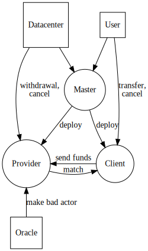

# Ethereum MVP

- [Deliverable Applications](#deliverable-applications)
  * [Server](#server)
    + [Uses](#uses)
  * [Web Client](#web-client)
    + [Uses](#uses-1)
- [Contracts](#contracts)
  * [Master](#master)
    + [Functions](#functions)
      - [deployProvider](#deployprovider)
      - [deployClient](#deployclient)
      - [match](#match)
  * [Provider](#provider)
    + [State Varaibles:](#state-varaibles-)
      - [matchedClient](#matchedclient)
      - [networkAddress](#networkaddress)
    + [Functions](#functions-1)
      - [Provider](#provider-1)
      - [match](#match-1)
      - [cancel](#cancel)
      - [uncancel](#uncancel)
      - [withdrawal](#withdrawal)
  * [Client](#client)
    + [State Variables](#state-variables)
      - [matchedProvider](#matchedprovider)
      - [minimumBalance](#minimumbalance)
      - [matchStartTime](#matchstarttime)
      - [totalBilled](#totalbilled)
      - [unsettledBalance](#unsettledbalance)
      - [maxUnsettledBalance](#maxunsettledbalance)
  * [Functions](#functions-2)
    + [match](#match-2)
    + [setBill](#setbill)
    + [bill](#bill)
    + [cancel](#cancel-1)
    + [providerCancel](#providercancel)
    + [unCancel](#uncancel)
- [Modifiers](#modifiers)
  * [Parameterized](#parameterized)
  * [Maintainable](#maintainable)
  * [Delinquent](#delinquent)
  * [Cancellable](#cancellable)
  * [Matchable](#matchable)
  * [BadActor](#badactor)
  * [Ownable](#ownable)
  * [Payable](#payable)
- [Future Work](#future-work)
- [Open Questions](#open-questions)
  * [Fee Structure](#fee-structure)

## Deliverable Applications

### Server

For internal use only

#### Uses

* Deploy the Master contract
* Run an order mathcing Daemon

### Web Client

#### Uses

* Deploy Client or Provider contract
* Integrates with Metamask for tranaction signing

## Contracts

### Master

We choose to deploy all Provider and Client contracts from a single Master contract in order to have the ability for programmatic contract discovery. If users deploy their own Provider or Client contracts we will not know where they are.

#### Functions

The master contract is deployed and Maintained by Overclock Labs
The master contract has two functions anyone can call and one function only the maintainer can call

##### deployProvider

* Deploys a Provider contract
* Callable by anyone

##### deployClient

* Deploys a Client contract
* Callable by anyone

##### match

* Matches a Provider contract with a Client contract. Matches must be done on a first come first serve basis. The only way to guarentee this is to restrict the parties which are allowed to match the Provider and Client contracts. The result of the matching is publicy viewable on the blockchain, therefor there is no risk that the maintainer can secrety give preference to certain orders without the potential of being exposed.

* Callable by the maintainer

### Provider

Extended by: Ownable, Parameterized, Matchable, Cancelable, Payable, BadActor

#### State Varaibles:

##### matchedClient

* The Ethereum address of the Client contract matched with this Provider contract

##### networkAddress

* The IP or URL of the provider which can be contacted to initate mainifest distribution

#### Functions

##### Provider

* Contract constructor
* Sets available resources, maintainer address, client constraints

##### match

* Tries to match with a Client contract
* Checks if Client contract has compatable parameters

##### cancel

* Marks the contract as cancelled
* May charge the Provider an early cancellation fee

##### uncancel

* Marks the contract as not cancelled
* Allows contract to be re-matched

##### withdrawal

* Sends the contract ETH balance to the maintainer

### Client

Extended by Ownable, Parameterized, Matchable, Cancelable, Payable, Deliquent

#### State Variables

##### matchedProvider

* The address of the matched Provider contract

##### minimumBalance

* The minimum ETH balance the client has promised to maintain in the contract

##### matchStartTime

* The time the contract was matched

##### totalBilled

* The total amount the Client has sent to the matched Provider

##### unsettledBalance

* The total amount the Client owes to the matched Provider

##### maxUnsettledBalance

* The amount that the client has promised not owe greater than

### Functions

#### match

* Called by a Provider contract to attempt a match

#### setBill

* Determines the unsetled balance of the Client

#### bill

* Sends unsettled balance to the matched Provider

#### cancel

* Cancel the contract

#### providerCancel

* Allows the matched Provider to cancel the contract and withdraw all funds if the Client is delinquent

#### unCancel

* Uncancel the contract to enable matching

## Modifiers

* These are contracts that act as small modules of behavior and state to be extende by large contracts

### Parameterized

* List of contract parameters common between Client and Provider
* Examples: cpu, ram, cancelFee.

### Maintainable

* Allows an address to be the maintainer and transfer maintainorship to another address

### Delinquent

* A contract can be marked as Delinquent is there are issues with payment

### Cancellable

* A contract can be marked canceled

### Matchable

* A contract can be marked matched

### BadActor

* A Provider can be marked as a bad actor

### Ownable

* Mark the address which deployed the contract as the owner

### Payable

* Allows ETH to be sent to a contract

## Future Work

* Multiple Clients matched per single Provider contract which lists aggregate resources. Available resouce calculations are managed by the contract
* Oracle permission to mark Providers as bad actors
* Use a math library for accurate calcuation of billing
* Blacklist URLs of bad acting Providers

## Open Questions

### Fee Structure

Which, or both, should be implemented?

Client Burden: client maintains a minimum balanace, if balance falls below minimum, provider can cancel without being charged a fee
    - provider can ensure he is always payed
    - client has tp 'waste' money by keeping it sitting in a contract

Provider Burden: if client misses too many payments, provider can cancel without incurring fees
    - provider may not be paid for services
    - client is allowed flexability of payment
