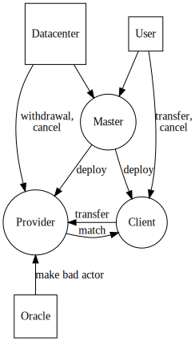

# Ethereum MVP

- [Applications](#applications)
  * [Order Matching Daemon](#order-matching-daemon)
    + [PSQL database](#psql-database)
    + [Go App](#go-app)
    + [Seeding server](#seeding-server)
  * [Web Client](#web-client)
- [Contracts](#contracts)
  * [Master](#master)
    + [Functions](#functions)
      - [deployClient](#deployclient)
      - [deployProvider](#deployprovider)
      - [matchContracts](#matchcontracts)
  * [Client](#client)
    + [State Variables](#state-variables)
      - [matchedProvider](#matchedprovider)
      - [matchStartTime](#matchstarttime)
      - [totalBilled](#totalbilled)
    + [manifest](#manifest)
    + [Functions](#functions-1)
      - [matchProvider](#matchprovider)
      - [bill](#bill)
      - [withdrawl](#withdrawl)
      - [reset](#reset)
      - [cancel](#cancel)
      - [providerCancel](#providercancel)
  * [Provider](#provider)
    + [State Variables:](#state-variables-)
      - [matchedClient](#matchedclient)
      - [networkAddress](#networkaddress)
    + [Functions](#functions-2)
      - [Provider](#provider-1)
      - [matchClient](#matchclient)
      - [reset](#reset-1)
      - [cancel](#cancel-1)
      - [clientCancel](#clientcancel)
      - [makeMadActor](#makemadactor)
      - [withdrawal](#withdrawal)
- [Modifiers](#modifiers)
  * [Parameterized](#parameterized)
  * [Maintainable](#maintainable)
  * [Matchable](#matchable)
  * [BadActor](#badactor)
  * [Ownable](#ownable)
  * [Payable](#payable)
- [Future Work](#future-work)

## Applications

### Order Matching Daemon

#### PSQL database

* Tables mirror data within the contracts
* Tables: Clients, Providers

#### Go App

* Operator: Master contract maintainer
* Algorithm
  ** Gets internal transactons from the Master contract
  ** Creates records for addresses of all deploy Client and Provider transactions
  ** Creates records for the state of all found Client and Provider contracts
  ** Iterates through unmatched Provder contracts searching for a matching Client contract
  ** Order matching precedence is closest match then time
  ** Calls a matching function on the Master contract for the matched contracts
  ** Waits for a new Ethereum block and repeates this process

#### Seeding server

Operatior: anyone
* Seeds encrypted client manifests

### Web Client

* For users and datacenters to deploy Client or Provider contracts
* For users to interact with deployed contracts
* Integrates with Metamask for web3 access and ETH account management
* Sign and encrypts then sends deployment manifest to the seeding server
* Looks up a users in-progress contracts
* Lists unmatched contracts, so a client or provider can choose to create an order specifically to match it.

## Contracts

### Master

We choose to deploy all Provider and Client contracts from a single Master contract in order programmaticly discover Client and Provider contracts. The Master contract is deployed and Maintained by Overclock Labs.

#### Functions

##### deployClient

* Deploys a Client contract
* Callable by anyone

##### deployProvider

* Deploys a Provider contract
* Callable by anyone

##### matchContracts

* Matches a Provider contract with a Client contract.
* Callable by the maintainer

### Client

Extended by Ownable, Parameterized

#### State Variables

##### matchedProvider

* The address of the matched Provider contract

##### matchStartTime

* The time the contract was matched

##### totalBilled

* The total amount the Client has sent to the matched Provider

#### manifest

* The magnet link to the encrypted manifest

#### Functions

##### matchProvider

* Matches with a Provider
* Takes service level parameters from the Provider contract

##### bill

* Sends unsettled balance to the matched Provider

##### withdrawl

* Maintainer can withdrawl ETH from the contract

##### reset

* resets fields allowing for the contract to be re-matched with a Provider

##### cancel

* Cancel the contract

##### providerCancel

* Allows the matched Provider to cancel the contract

### Provider

Extended by: Ownable, Parameterized, Matchable, Cancelable, Payable, BadActor

#### State Variables:

##### matchedClient

* The Ethereum address of the Client contract matched with this Provider contract

##### networkAddress

* The IP or URL of the provider which can be contacted to initiate manifest distribution

#### Functions

##### Provider

* Contract constructor

##### matchClient

* Matches with a valid Client contract

##### reset

* resets fields allowing for the contract to be re-matched with a Client

##### cancel

* Cancells the contract

##### clientCancel

* Allows the matched Client to cancel the contract

##### makeMadActor

* Marks the contract as a bad actor

##### withdrawal

* Maintainer can withdrawal ETH

## Modifiers

* These are contracts that act as small modules of behavior and state to be extended by large contracts

### Parameterized

* List of contract parameters common between Client and Provider
* Examples: cpu, ram, cancelFee, etc.

### Maintainable

* Allows an address to be the maintainer and transfer maintainership to another address

### Matchable

* A contract can be marked matched

### BadActor

* A contract can be marked as a bad actor

### Ownable

* The address which deployed the contract as the owner
* This address cannot be changed

### Payable

* Allows ETH to be sent to a contract

## Future Work

* Multiple Clients matched per single Provider contract which lists aggregate resources. Available resource calculations are managed by the contract
* Use a math library for accurate calculation of billing
